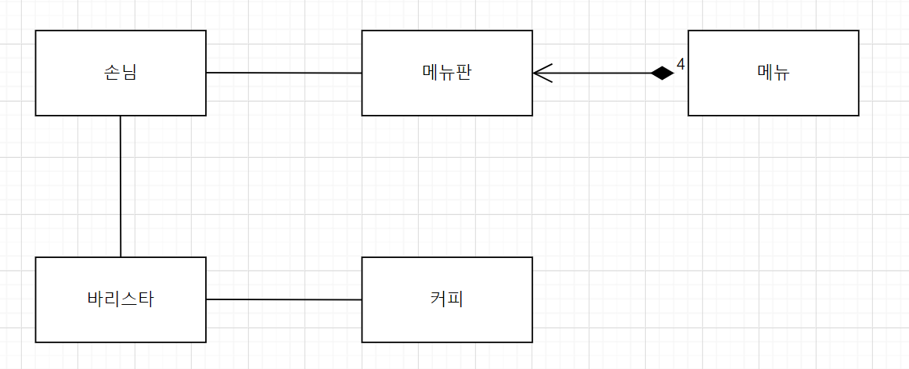

# OOP_JAVA 

## 1. 객체지향적으로 커피 전문점 이해하기
> 도메인: 커피를 주문하는 과정을 객체 간 협력관계로 구현하는 것
> * 도메인이란 해결 할 문제 정의 또는 관심 주제
### 가. 커피 전문점의 객체화
- 손님(Object 이하 O)는 메뉴판(O)의 여러 항목(O) 중 하나 또는 다수를 선택하여 
바리스타(O)에게 주문함
- 바리스타(O)는 주문을 받은 항목(O)에 맞는 커피(O)를 제조함
### 나. 객체 간 관계
- 손님은 메뉴판에서 하나 또는 다수의 항목을 선택함
- 손님은 바리스타에게 선택한 항목에 맞는 커피를 주문함
- 바리스타는 커피를 제조함 등등
### 다. 객체 분류
- 객체의 클래스: 객체의 구현에 대한 정의, 객체 내부의 상태와 상태를 구현하기 위한 연산이 포함됨
- 객체의 타입: 객체의 인터페이스, 상태와 행동이 동일한 객체의 묶음
- 4가지 종류의 커피 객체는 모두 '커피 타입'으로 묶을 수 있음
- 반대로 '커피 타입'에는 4가지의 '커피 항목 타입'의 인스턴스 존재
### 라. 타입 간 관계
- 핵심요소 1) 도메인을 구성하는 타입
- 핵심요소 2) 타입 간 관계를 파악하여 도메인을 이해
- 메뉴판 타입과 메뉴 항목 타입 간 관계: 포함(containment) or 합성(composition) 관계, 메뉴 항목 타입 4가지는 메뉴판 타입에 일부로 포함됨.
- 손님과 메뉴판 간 관계: 연관(association) 관계, 각 타입 간 포함되지 않는 상태가 아니고 연관성만 있음. ex) 손님과 바리스타의 관계

## 2. 객체지향적으로 설계하기
### 객체지향적 설계 목표: 협력하는 자율적인 객체들의 공동체 창조
### 가. 협력 설계
- 객체지향 설계의 첫번째 목표: 훌륭한 협력을 설계하는 것
- 협력 설계 포인트 1) 객체 보다 도메인의 주요 메세지 선택
- 협력 설계 포인트 2) 메세지를 수신하는 객체 선택
- 협력 설계 포인트 3) 메세지 수신 객체의 메세지 처리 책임 명시, 필요 시 다른 객체에 도움 요청 등 
### 가-1) 첫번째 메세지: 커피 주문
- 메세지 수신 객체: 손님
- 손님 객체의 메세지 처리 책임: 특정 메뉴의 이름을 선택
- 손님 객체 스스로 메뉴의 옵션을 알 수 없으므로 메뉴 객체에 특정 메뉴 항목을 요청
### 가-2) 두번째 메세지: 특정 메뉴 항목 요청
- 메세지 수신 객체: 메뉴판
- 메뉴판 객체의 책임: 손님 객체로부터 전달 받은 특정 메뉴의 이름에 맞는 메뉴 항목 객체를 손님에게 전달
### 가-3) 세번째 메세지: 커피 제조
- 메세지 수신 객체: 바리스타
- 바리스타 객체의 책임: 손님 객체로부터 전달 받은 메뉴 항목 객체에 맞는 커피 객체를 생성하여 손님에게 전달
- 바리스타 객체의 고유 상태와 로직으로 커피 객체 생성 가능(자율적인 객체)
### 나. 인터페이스 정리
- 메세지를 수신한 객체 내 메세지와 연관된 operation 정의 ex) 손님 객체 내 커피 주문 operation 정의해야 함
- 협력 설계 과정에서 정의된 operation은 외부에서 접근 가능한 공용 인터페이스임(public 선언)
- 인터페이스와 구현의 분리: 인터페이스를 먼저 정의한 후, 구현 시도
## 3. 객체지향적으로 구현하기
- 객체의 내부로직을 구현하면서 인터페이스와 상이한 부분이 있다면 인터페이스도 함께 수정
## Reference
### 김승영, https://woowabros.github.io/study/2016/07/07/think_object_oriented.html
### 조영호, 객체지향의 사실과 오해